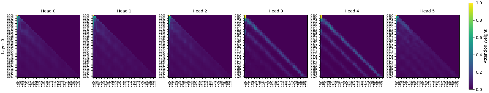
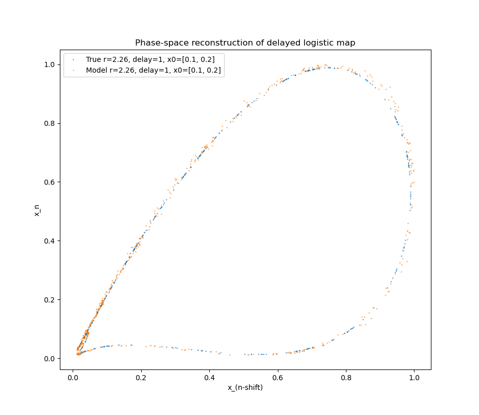
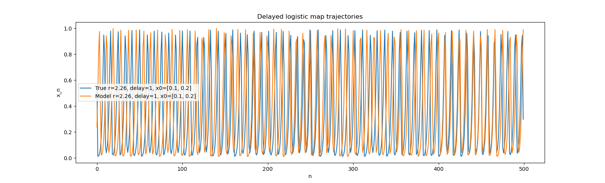
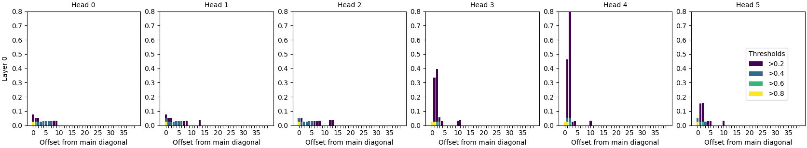
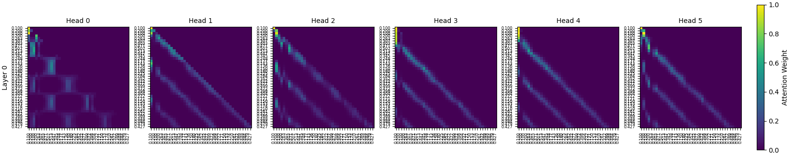
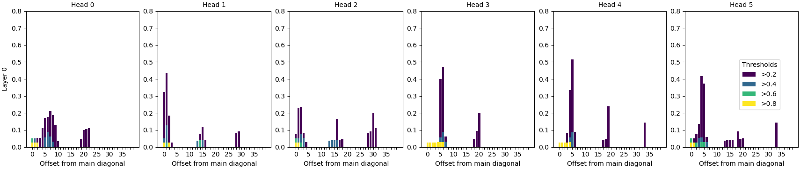
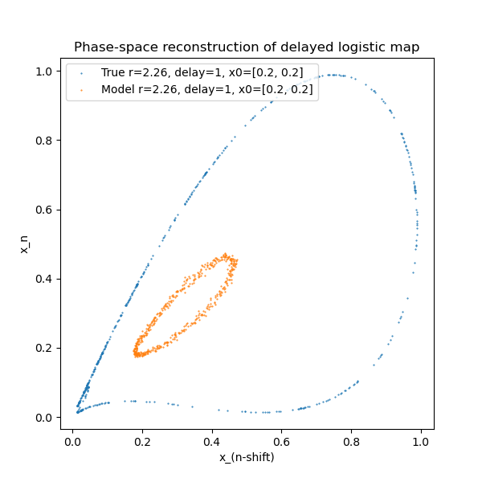
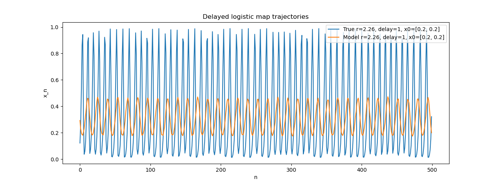

# minGPT for dynamical systems
We train a transformer on the paths of a delayed logistic map to see if the time delay that determines the paths appears in learned attention scores. We expected high attention scores for inputs offset by the delay value (i.e., along diagonal bands offset from the main diagonal). We found higher scores along diagonal bands, but not at the offsets we expected.

### Motivation
This project investigates the self-attention block of an autoregressive (decoder-only) transformer model, by training the model on easy-to-understand sequences derived from a recurrence relation.

A key feature of the transformer model is the self-attention block, which detects similarities between components of a sequence to use to predict the next value in the sequence. The attention scores that the transformer computes resemble a covariance calculation, and we expect to see higher scores between related inputs.

To test this theory, we look at the first layer of attention scores for a transformer trained on sequences generated by the recurrence relation
$$x_{i+1} = r * x_i * (1-x_{i-delay}).$$ This equation is called a delayed logistic map, and it is an example of a time-delay dynamical system. Since the next value of the sequence can be determined exactly by looking "delay" steps into the past, our hypothesis is that the attention scores "delay" units away from the diagonal should be high.

### Methods
The transformer we used is based on Andrej Karpathy's [minGPT](https://github.com/karpathy/minGPT), adapted to continuous inputs. The key changes are
- **embedding**: minGPT is built for inputs drawn from a finite vocabulary, and embedded into high-dimensional $\mathbb{R}^n$ via a lookup table. Our continuous version is built for inputs in low-dimensional $\mathbb{R}^n$, and embedded into high-dimensional $\mathbb{R}^n$ via a linear map
- **output of transformer model**: minGPT outputs logits over the finite vocabulary, which we apply softmax to obtain a discrete probability distribution. Our continuous version outputs a mean and log-variance for each dimension of the original input, which are interpreted as parameters for a Gaussian distribution
- **loss function**: minGPT uses cross-entropy to compare a prediction to the true next value. Our continuous version uses Gaussian negative log-likelihood, the continuous analog (both compute -log p(true next token))
- **generation**: Instead of using the discrete probability distribution to sample, we sample from a Gaussian. Temperature can adjust the variance of the Gaussian
- **weight initialization**: In our continuous version, the last linear map that converts transformer output into Gaussian parameters has weights initialized to very small values so the linear map doesn't interpret the transformer output to mean a very large variance early on, potentially causing large loss function values and unstable training.

### Results
**Run 1**: 
The transformer was trained on two trajectories in $\mathbb{R}$ of length $10^6$ following the delayed logistic equation with a delay of $1$, $r$ of $2.26$, and initial two states $(.1, .1)$ and $(.1, .15)$. In training, the test trajectories used were two paths of length $10^4$ following the same equation with initial two pair of states $(.1, .2)$ and $(.1, .175)$. The transformer was trained for 16,000 iterations.

The first layer of attention scores, calculated when asking the model to predict the next value of a sequence obtained from the true model (the sequence provides the labels on both axes below), are plotted below. Only a subset of the full training block size of 128 is shown, for readability, but the remaining scores follow the same pattern.

The model's generated output, compared to a true path, is given in the next two figures:

<!--  -->

<!--  -->

Qualitatively, the model does a good job at predicting the trajectory of a path. We can see higher attention scores at bands off the diagonal, as we predicted, but not exactly at the offset of our delay parameter. To better see at what offsets the attention scores light up, the following bar graph counts the number of parameters on each off-diagonal with scores reaching a certain threshold:

**Run 2**:
The transformer was trained on two trajectories in $\mathbb{R}$ of length $10^6$ following the delayed logistic equation with a delay of $3$, $r$ of $1.46$, and initial two states $(0.05, 0.05, 0.05, 0.05)$ and $(0.1, 0.2, 0.1, 0.2)$. In training, the test trajectories used were two paths of length $10^4$ following the same equation with initial two tuples states $(0.1, 0.15, 0.1, 0.15)$ and $(0.2, 0.2, 0.2, 0.2)$. The transformer was trained for 43,000 iterations.

The attention scores are here:

The model did a poor job of extrapolating learnings from the delayed logistic map with delay parameter 3 to trajectories with delay parameter 1, as shown below. This suggests that the transformer currently learns a more specific structure dependent on the delay parameter, instead of immediately generalizing to a more general structure encompassing all delayed logistic maps.

<!--  -->

<!--  -->

### To-dos
It was exciting to see patterns appear in the attention scores that were similar to our expectations in some ways (in diagonals offset from the main diagonal), though different in others (which diagonals would light up). A lot more can be done, such as
- **High priority**: Is the transformer simply learning the long-run attractor behavior, so there is no motivation to learn the delay dependence? Should test by training on shorter trajectories of many initial conditions, instead of longer trajectories of only two initial conditions
- **High priority**: What do attention scores look like when there is no delay dependence? Do diagonal bands still show up? 
- Finding more quantitative ways to evaluate the model's ability to predict a trajectory
- Using these quantitative ways to compare a transformer's predictive ability to other methods of time series prediction, such as a basic neural network with no attention block
- Training an even more pared down transformer, with fewer layers of self-attention, to see how much performance changes
- Training with trajectories from several parameters together to see how the attention scores change.
